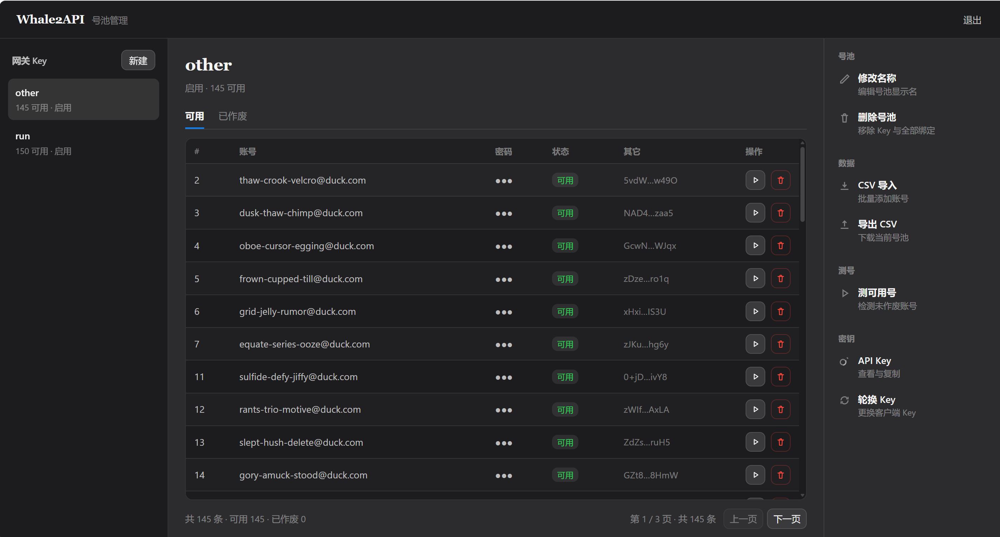

# Whale2API

DeepSeek 反代，支持 896K 上下文的 `deepseek-flash` (v4.1)

## 致谢与声明

本项目在 **[ds2api](https://github.com/CJackHwang/ds2api)**（作者 [CJackHwang](https://github.com/CJackHwang)）基础上二次开发并重命名为 Whale2API

【感谢Linux.do社区对项目的支持，感谢上游作者及贡献者的开源工作】

CJackHwang佬的作品我个人使用过很长一段时间，为我减轻了许多经济上的负担，中转太多导致官方出手很是可惜

本项目重新提供更稳定版本的开源。网页端限制导致模型效果并不好，还为了防封禁做了很多限制，希望自用而非盈利

## 快速开始

### Docker

#### 源码构建

```
copy .env.example .env
# 编辑 .env：设置 POOL_UI_ADMIN_TOKEN
docker compose up -d --build
```

#### release

```
docker network create whale2api

docker run -d --name device-harvest --restart unless-stopped --network whale2api \
  -e PORT=8090 -e HARVEST_CONCURRENCY=2 \
  ghcr.io/tangsong404/whale2api-device-harvest:latest

docker run -d --name whale2api --restart unless-stopped --network whale2api \
  -p 5103:5001 \
  -e PORT=5001 \
  -e WHALE2API_DATABASE_PATH=/data/whale2api.db \
  -e DEVICE_HARVEST_URL=http://device-harvest:8090 \
  -v whale2api-data:/data \
  ghcr.io/tangsong404/whale2api:latest

docker run -d --name poolui --restart unless-stopped --network whale2api \
  -p 5010:5010 \
  -e POOL_UI_PORT=5010 \
  -e WHALE2API_DATABASE_PATH=/data/whale2api.db \
  -e DEVICE_HARVEST_URL=http://device-harvest:8090 \
  -e POOL_UI_ADMIN_TOKEN=change-me \
  -v whale2api-data:/data \
  ghcr.io/tangsong404/whale2api:latest /usr/local/bin/poolui
```

### 本地开发

```
# 先起采集服务
cd tools/device-harvest && npm install && xvfb-run -a node harvest.mjs serve --port 8090 &
# 网关/面板需指向它
DEVICE_HARVEST_URL=http://127.0.0.1:8090 go run ./cmd/whale2api   # :5001
DEVICE_HARVEST_URL=http://127.0.0.1:8090 go run ./cmd/poolui      # :5010
go test ./...
```

## 使用说明

| 地址                                                                                     | 用途       |
| -------------------------------------------------------------------------------------- | -------- |
| [http://127.0.0.1:5103/v1/chat/completions](http://127.0.0.1:5103/v1/chat/completions) | 网关 API   |
| [http://127.0.0.1:5010](http://127.0.0.1:5010)                                         | 号池 WebUI |



建议50个号起用（批量注册参考我的仓库 `signup-god`）

导入csv格式: `email,password[,device_id]`（第三列可留空，留空即按需采集）


## 改了什么

### 优化

1.去除所有和`DS2API`相关文本，大改提示词、工具调用符号降低封禁率

2.号池增加了对`禁言`（不是`封禁`）机制的检测，且持久化由json改为sqlite

3.增添v4.1模型 `deepseek-flash`，支持多模态（图片输入）

4.优化工具调用，减少`光说不做`与`假想完成`的情况

### 限制

1.暂时仅支持OpenAI Chat Completions兼容

2.所有模型上下文限制为 896K（可用环境变量调整）

## 参与贡献

欢迎通过 Pull Request 参与改进，包括但不限于：

- Bug 修复与测试补充
- 文档与使用说明完善
- 号池、网关稳定性与可观测性优化

提交 PR 前建议：

1. 在本地执行 `go test ./...` 确保通过
2. 保持改动聚焦，说明修改动机与验证方式
3. Fork 后从功能分支发起 PR，便于 review

如有较大改动，建议先开 Issue 简要讨论方案，避免重复劳动。